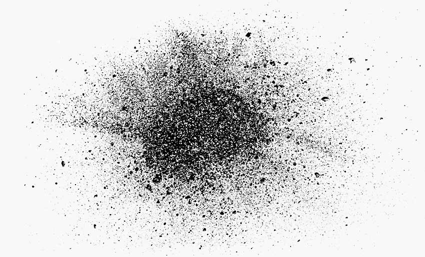
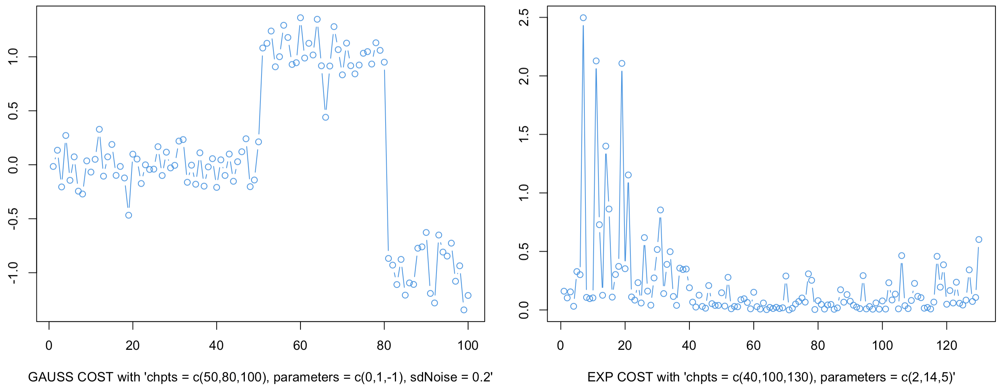

```{r setup, include=FALSE}
knitr::opts_chunk$set(echo = TRUE)
```


<a id="top"></a>

# dust Vignette

### Vincent Runge and Simon Querné

#### LaMME, Evry University, November 24, 2025


<center>

</center>

> [Quick start](#start)

> [Models And Data Generators](#Models)

> [dust 1D and MD Algorithms](#dust1D)

> [dust 2D Algorithms](#dust2D)

> [Rcpp Structure and new cost integration](#rcpp)

> [Pruning Capacity](#pruning)

<center>

</center>

<a id="start"></a>

## Quick start

### Introduction

The `dust` package contains methods **for detecting multiple change-points within time-series** based on the optimal partitioning algorithm, which is a dynamic programming (DP) algorithm. Our algorithms optimize a penalized likelihood and the DP algorithm is encoded with pruning rules for reducing execution time. The novelty of the `dust` package consists in its pruning step. We use a **new pruning rule**, different from the two standard ones: [PELT rule (2012)](\doi{10.1080/01621459.2012.737745}) and [FPOP rule  (2017)](\doi{10.1007/s11222-016-9636-3}).

We called this method the **DUST** pruning rule, standing for **Du**ality **S**imple **T**est. This method is based on considering some optimization problems under inequality constraints and its dual for discarding indices in the search for the last change-point index.

We propose change-point detection algorithms working with different models derived from the **exponential family** (Gauss, Poisson, Exponential...). 

We provide a polymorphic structure in Rcpp that enables users **to easily add custom cost functions of their choice**. Detailed instructions are available [in this Section](#rcpp), and users only need to define a few Rcpp functions: the minimal cost function, the dual function, and its derivative, along with some domain information for the dual.

Various tests and simulations are included in this **README file** and the **simulations folder**, demonstrating that the DUST dual approach is **highly efficient across all regimes** (whether detecting few or many changes) and shows improved computational efficiency compared to PELT and FPOP. Additionally, unlike these methods, DUST can also reduce computation time for multivariate cost functions (See Section [pruning](#pruning)).


### Installing the dust Rcpp package

**REQUIREMENTS:**
- R >= 3.4
- devtools : `install.packages('devtools')`

The package can then be installed from the github repo with the following command:

```{r, message=FALSE, eval = FALSE}
devtools::install_github("vrunge/dust")
```

and imported with:

```{r, message=FALSE, eval = FALSE}
library(dust)
```


### A simple example

We generate some 1D time series of length `400` from the Gaussian model and one change in the middle of the sequence.

```{r, message=FALSE}
library(dust)
set.seed(2)
data <- dataGenerator_1D(chpts = c(200,400), c(0,1), type = "gauss")
```

We segment data using the dust 1D method coded in Rcpp. We give data, the penalty value and the type of cost to be used. It can be one of the following: `"gauss"` (additional parameters `sdNoise` and `gamma`), `"exp"`, `"poisson"`, `"geom"`, `"bern"`, `"binom"` (additional parameter `nbTrials`), `"negbin"` (additional parameter `nbSuccess`) and `variance`. See next [Section](#Models).

```{r, message=FALSE}
dust.1D(data)
```

Here the penalty value is by default set to `2 log(n)` for `n` data points and the model to `gauss`. That is, we did
`dust.1D(data,  penalty = 2*log(length(data)), model = "gauss")`
 

The result is a list whose elements are:

- `changepoints `: A vector of change points (the index ending each of the segments)

- `lastIndexSet`: The list of non-pruned indices at the end of the analysis 

- `nb`:  The number of indices to consider at each time step (its length is equal to data length) 

- `costQ` The minimal (penalized) cost of the optimization problem at each time step.

Vector `nb` is a kind of complexity control vector, its values are directly related to the algorithm's time complexity.


[(Back to Top)](#top)


<center>

</center>

<a id="Models"></a>

## Models And Data Generators


### Data Generators in 1D and MultiD

**dataGenerator_1D** is used to generate data with a given vector of change-point (e.g. `chpts = c(50,100)` for one change at position `50` and data length `100`), parameter vector (e.g. `parameters = c(0,1)`) and a type of probability distribution (from the exponential family) in `type`. The following types are available in the current package version:
  
- `type = "gauss"` (additional parameters `sdNoise` and `gamma`)

- `type = "exp"` 

- `type = "poisson"`

- `type = "geom"` 

- `type = "bern"` 

- `type = "binom"` (additional parameter `nbTrials`)

- `type = "negbin"` (additional parameter `nbSuccess`)

- `type = "variance"`

We show two data examples with Gaussian and Exponential models (`"gauss"` and `"exp"`)

<center>

</center>

and some other examples with integer-valued cost (`"poisson"`,`"geom"`, `"binom"`, `"negbin"`):
<center>

</center>


**dataGenerator_MD** concatenates `p` copies of `dataGenerator_1D` function.

Additional information and examples are easily accessible in the help of these functions (e.g. run `?dataGenerator_MD`).


### Data Generators in 2D

**dataGenerator_meanVar** is used for change in mean and variance for the Gaussian problem

**dataGenerator_Reg** generates 2-dimensional data frame `(x,y)` following a simple linear regression link (`y = Ax + B + noise`) with `A` and `B` changing over time (after each change-point)


[(Back to Top)](#top)


<center>

</center>

<a id="dust1D"></a>

## dust 1D and MD Algorithms


We start with one simple example with the `exp` model:

```{r, message=FALSE}
data <- dataGenerator_1D(chpts = c(5*1e5,1e6), parameters = c(2,1), type = "exp")
system.time(res <- dust.1D(data = data, model = "exp"))[[1]]

res$changepoints
```

A fundamental information relies in the number of indices to consider at each data step. 
It is saved into the field `nb`. 


[(Back to Top)](#top)

<center>

</center>

<a id="dust2D"></a>

## dust 2D Algorithms


[(Back to Top)](#top)


<center>

</center>

<a id="rcpp"></a>

## Rcpp Structure and new cost integration

[(Back to Top)](#top)


<center>

</center>

<a id="pruning"></a>

## Pruning Capacity

Analysis of the pruning capacity (return field `nb`) for some of our algorithms. We explore in particular the impact of the different choices for the dual max evaluation.


[(Back to Top)](#top)


<center>

</center>


## Hidden Functions and Parameters (Package Development)

### OP in R

The base function `OP_R` is used to compute the change-point vector with the simplest dynamic programming algorithm with no pruning. This method is of quadratic time complexity. We propose 3 such functions:`OP_R_1D`, `OP_R_MD`, `OP_R_2param`.

`OP_R_1D <- function(data, penalty = 2*log(length(data)), type = "gauss")`

Example: `OP_R_1D(dataGenerator_1D(chpts = c(200,400), c(0,1), type = "gauss"))`


`OP_R_2param` is used for:

- `type = "meanVar"` change in Gaussian data in mean and variance

- `type = regression` change in simple regression model


### Dual Functions
  
`dual_1D` returns the value of the dual at a point `mu` when comparing index `s1` with the constraint from index `s2` at time `t`. With option `OP = TRUE` the optimal partitioning algorithm is used to have the true constants in the cost functions with penalty `penalty` and a pruning option `pruningOpt`.

`dual_1D <- function(mu, data, s1, s2, t, type = "gauss", OP = FALSE, penalty = 2*length(data), pruningOpt = 3)`

- `data` is raw data

- If `OP` is `true`, we run the OP algorithm to have the optimal cost vector to use in cost functions. See the function `OP_R`.

- at time `t`, we evaluate the dual function at point `mu` when trying to remove index `s1` using function linked to index `s2` (we have a unique constraint, which means that the dual is a one-parametric function)

- Depending on the `type`, different functions `A`, `B`, `statistic`, `mu_max` and `evalDual` are used (see the code in file `functions_by_type.R`)

Function `dual_1D` allows us to study the shape of the dual. 

### dust_R 

We propose a few R functions computing the change-point location with dust method: `dust_R_1D`, `dust_R_MD`, `dust_R_2Dquad`.

The function `dust_R_1D` has the following parameters:

`dust_R_1D <- function(data, penalty = 2*log(length(data)), type = "gauss", pruningOpt = 2)`


We have different type of possible pruning:

- `pruningOpt == 0`: nothing

- `pruningOpt == 1`: PELT

- `pruningOpt == 2`: dust

- `pruningOpt == 3`: dust + PELT
  

and returns a list of two elements:

- `changepoints`: the change-points found by the algo

- `nb`: the number of indices to consider in the minimization at each time step

- `lastIndexSet`: the vecotr of indices saved by the algo in the dynamic programming algorithm at the last iteration

- `costQ`: the vector of optimal cost (of size `length(data)`)


### Plot functions 


`plot_dual_1D` is a function displaying the result of `dual_1D` for a vector of mu values.

`plot_dual_1D <- function(mu =  (1:99)/100,`
                         `data, s1, s2,`
                         `type = "gauss",`
                         `OP = FALSE,`
                         `penalty = 2*length(data))`
                         

We use the function `plot_dual_1D` with `OP = TRUE` to plot the true dual function seen by the dynamic programming algorithm. 

What we called the "pruning interval" is the interval of values between the vertical green lines for which the dual function takes a value higher than the pruning threshold (horizontal line in red), so that the index considered `s1` is pruned by `s2` at time `n`. 


Using function `barplot_dual_1D` we can repeat the generation of the pruning interval `nb` and count the number of time each value mu is in this interval.

We add the values in the bar plot only if at the final time step `n`, the index `s1` has not been removed by the algorithm (the pruning option is given by option `pruningOpt`).

`barplot_dual_1D <- function(nb = 1000, s1 = 18, s2 = 15,`
                            `n = 20,`
                            `oneParam = 0,`
                            `type = "gauss",`
                            `penalty = 2*log(n),`
                            `pruningOpt = 3)`
                            

[(Back to Top)](#top)


