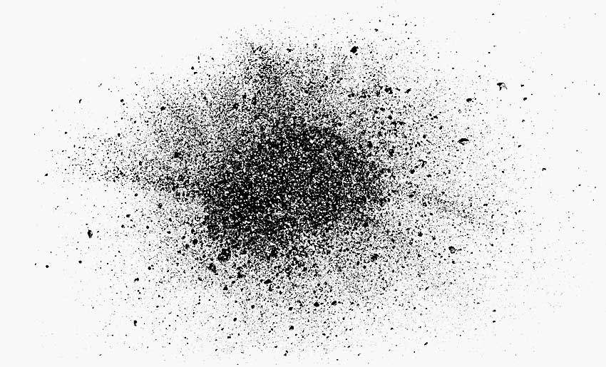
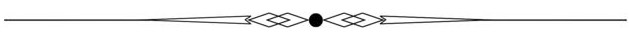
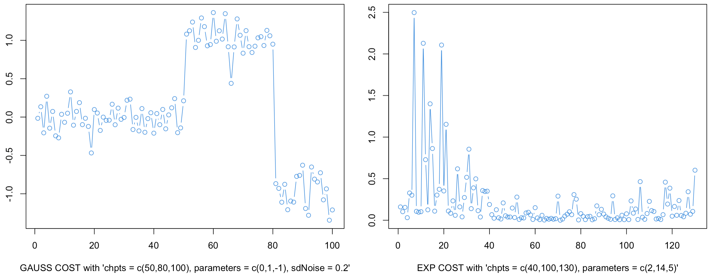
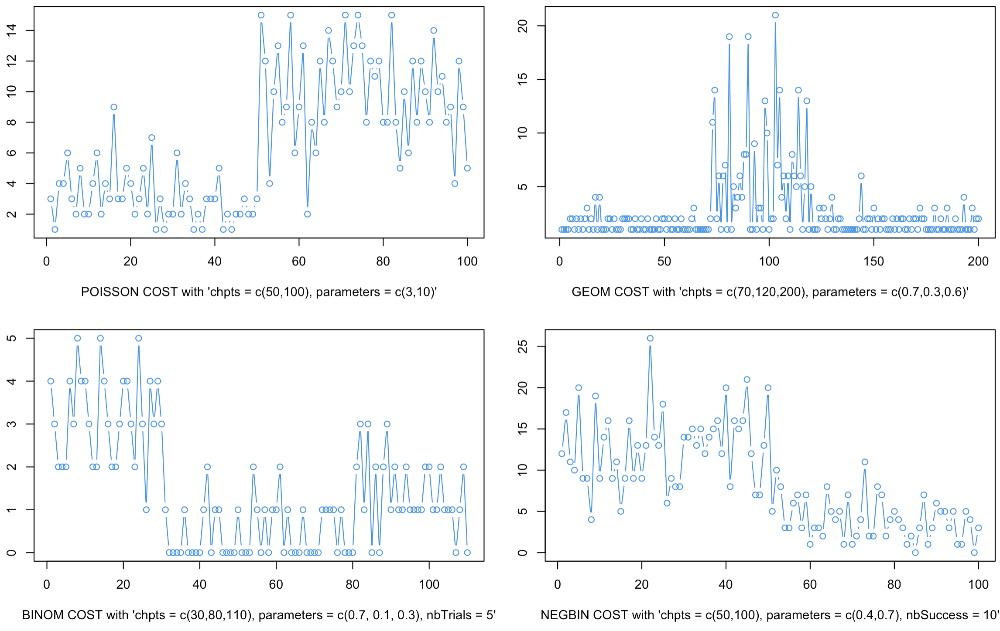

# dust Vignette

### Vincent Runge and Simon Querné

#### LaMME, Evry University, November 24, 2025

> [Quick start](#start)

> [Models And Data Generators](#Models)

> [dust 1D and MD Algorithms](#dust1D)

> [dust 2D Algorithms](#dust2D)

> [Rcpp Structure and new cost integration](#rcpp)

> [Pruning Capacity](#pruning)

## Quick start

### Introduction

The `dust` package contains methods **for detecting multiple
change-points within time-series** based on the optimal partitioning
algorithm, which is a dynamic programming (DP) algorithm. Our algorithms
optimize a penalized likelihood and the DP algorithm is encoded with
pruning rules for reducing execution time. The novelty of the `dust`
package consists in its pruning step. We use a **new pruning rule**,
different from the two standard ones: [PELT rule
(2012)](\doi%7B10.1080/01621459.2012.737745%7D) and [FPOP rule
(2017)](\doi%7B10.1007/s11222-016-9636-3%7D).

We called this method the **DUST** pruning rule, standing for
**Du**ality **S**imple **T**est. This method is based on considering
some optimization problems under inequality constraints and its dual for
discarding indices in the search for the last change-point index.

We propose change-point detection algorithms working with different
models derived from the **exponential family** (Gauss, Poisson,
Exponential…).

We provide a polymorphic structure in Rcpp that enables users **to
easily add custom cost functions of their choice**. Detailed
instructions are available [in this Section](#rcpp), and users only need
to define a few Rcpp functions: the minimal cost function, the dual
function, and its derivative, along with some domain information for the
dual.

Various tests and simulations are included in this **README file** and
the **simulations folder**, demonstrating that the DUST dual approach is
**highly efficient across all regimes** (whether detecting few or many
changes) and shows improved computational efficiency compared to PELT
and FPOP. Additionally, unlike these methods, DUST can also reduce
computation time for multivariate cost functions (See Section
[pruning](#pruning)).

### Installing the dust Rcpp package

**REQUIREMENTS:** - R &gt;= 3.4 - devtools :
`install.packages('devtools')`

The package can then be installed from the github repo with the
following command:

    devtools::install_github("vrunge/dust")

and imported with:

    library(dust0)

### A simple example

We generate some 1D time series of length `400` from the Gaussian model
and one change in the middle of the sequence.

    library(dust0)
    set.seed(2)
    data <- dataGenerator_1D(chpts = c(200,400), c(0,1), type = "gauss")

We segment data using the dust 1D method coded in Rcpp. We give data,
the penalty value and the type of cost to be used. It can be one of the
following: `"gauss"` (additional parameters `sdNoise` and `gamma`),
`"exp"`, `"poisson"`, `"geom"`, `"bern"`, `"binom"` (additional
parameter `nbTrials`), `"negbin"` (additional parameter `nbSuccess`) and
`variance`. See next [Section](#Models).

    dust.1D(data)

    ## $changepoints
    ## [1] 200 400
    ## 
    ## $lastIndexSet
    ## [1] 400 399 397 388 202 200
    ## 
    ## $nb
    ##   [1]  1  1  2  2  1  1  1  1  2  2  2  2  2  3  3  3  3  4  3  2  3  2  2  3  3
    ##  [26]  3  4  4  4  4  4  2  2  2  3  3  4  4  4  4  4  5  5  4  4  4  4  4  4  5
    ##  [51]  5  5  6  5  4  4  4  3  4  4  4  3  4  4  5  4  5  5  5  5  6  5  6  6  7
    ##  [76]  7  6  5  5  4  4  3  3  4  5  4  5  5  5  6  6  5  5  4  4  4  3  3  4  4
    ## [101]  5  5  6  7  7  6  5  6  6  6  5  5  5  6  5  5  6  6  6  6  6  6  7  7  6
    ## [126]  6  5  5  6  6  6  5  6  5  5  3  3  3  4  4  4  5  4  4  5  5  6  5  6  5
    ## [151]  5  5  3  3  3  2  3  2  2  3  3  3  2  3  4  4  4  4  4  5  5  3  2  2  3
    ## [176]  3  2  3  3  3  3  3  4  4  4  5  4  4  4  5  5  5  5  5  4  3  4  5  5  5
    ## [201]  4  4  4  4  3  3  3  3  4  4  5  3  4  4  4  4  5  4  4  4  4  4  4  4  5
    ## [226]  6  5  5  4  5  4  4  3  3  4  4  4  4  5  5  4  5  5  5  4  5  4  5  5  4
    ## [251]  4  4  4  5  4  3  3  3  3  3  4  4  4  5  5  6  7  6  6  7  6  6  6  7  7
    ## [276]  8  9  8  7  7  5  5  5  6  6  7  7  7  7  7  7  8  9  9  9 10 11  9  8  7
    ## [301]  7  7  8  8  8  9  7  7  7  6  7  7  8  8  8  9  8  9  9 10 11 10  8  6  5
    ## [326]  5  6  7  7  8  8  7  8  9  9  7  6  6  7  6  7  7  7  8  9 10 10 11 10  9
    ## [351]  9  9  8  8  9  9  9 10 10 11 11 10 10 10 10  9  8  9 10  9  9  9  9 10 11
    ## [376] 11 11 11 11 10 11 12 11 11 12  8  7  6  6  4  5  4  4  4  5  5  6  6  5  5
    ## 
    ## $costQ
    ##   [1] -4.022279e-01 -1.267593e-01 -1.278318e-01 -8.102372e-03 -1.121228e-02
    ##   [6] -3.414730e-03 -1.825415e-02 -4.416584e-03 -2.813259e-01 -2.229251e-01
    ##  [11] -2.907585e-01 -5.136066e-01 -3.739740e-01 -1.542998e-01 -4.968553e-01
    ##  [16] -7.505057e-02 -1.734335e-01 -1.686645e-01 -3.181374e-01 -3.820502e-01
    ##  [21] -8.571542e-01 -5.236612e-01 -8.875855e-01 -1.450606e+00 -1.394230e+00
    ##  [26] -6.688866e-01 -7.525741e-01 -5.962307e-01 -7.443397e-01 -7.843620e-01
    ##  [31] -9.313906e-01 -9.796183e-01 -1.225696e+00 -1.115664e+00 -8.991228e-01
    ##  [36] -7.478083e-01 -4.255632e-01 -2.917919e-01 -2.208117e-01 -1.904747e-01
    ##  [41] -1.511024e-01 -2.900472e-02 -6.014370e-03 -7.816770e-02 -1.170170e-01
    ##  [46] -2.980141e-01 -2.586330e-01 -2.439990e-01 -2.211755e-01 -1.195013e-01
    ##  [51] -6.722658e-02 -2.110421e-01 -1.603429e-01 -2.698379e-01 -1.720865e-01
    ##  [56] -5.078464e-02 -3.729530e-02 -7.747343e-02 -1.450438e-01 -2.811718e-01
    ##  [61] -1.324903e-01 -2.953442e-01 -2.270373e-01 -2.369032e-01 -2.781173e-01
    ##  [66] -2.042917e-01 -7.613547e-02 -5.419173e-02 -5.676973e-02 -2.588030e-02
    ##  [71] -6.793863e-03 -1.196573e-02 -9.391976e-03 -1.742385e-02 -1.606051e-02
    ##  [76] -2.737087e-03 -2.465413e-02 -4.743650e-02 -9.009050e-02 -3.489261e-02
    ##  [81] -6.963843e-02 -1.686360e-02 -7.687353e-03 -3.503929e-04 -3.532448e-02
    ##  [86] -2.296002e-03 -9.442798e-03 -1.394265e-02 -2.143790e-02 -1.363725e-02
    ##  [91] -6.218275e-06 -1.598112e-02 -1.517003e-03 -3.640274e-03 -2.881743e-02
    ##  [96] -6.723937e-02 -1.375737e-02 -1.348983e-02 -3.077909e-02 -4.711884e-02
    ## [101] -1.971013e-02 -1.475189e-02 -2.038119e-02 -3.765625e-02 -6.381851e-02
    ## [106] -1.226973e-02 -2.115852e-03 -8.260794e-03 -3.835574e-03 -1.443742e-03
    ## [111] -9.689654e-04 -2.277909e-03 -2.601178e-04 -5.467229e-03 -1.228079e-02
    ## [116] -1.967751e-02 -4.846416e-02 -8.636734e-02 -8.973351e-02 -6.137605e-02
    ## [121] -1.066045e-01 -1.115907e-01 -1.951494e-01 -1.702607e-01 -1.189766e-01
    ## [126] -1.424479e-01 -1.115028e-01 -1.387851e-01 -6.956988e-02 -2.392704e-02
    ## [131] -3.869419e-02 -4.679921e-02 -7.232067e-02 -2.095485e-02 -4.753096e-02
    ## [136] -8.410212e-02 -1.234067e-01 -1.578902e-01 -2.729811e-01 -1.881172e-01
    ## [141] -1.579751e-01 -1.767121e-01 -1.377755e-01 -1.405734e-01 -1.742704e-01
    ## [146] -1.427114e-01 -1.720654e-01 -1.983515e-01 -1.577179e-01 -1.143978e-01
    ## [151] -1.546548e-01 -1.461142e-01 -1.783226e-01 -1.389755e-01 -1.972559e-01
    ## [156] -1.344473e-01 -1.670289e-01 -1.879307e-01 -1.999634e-01 -2.333747e-01
    ## [161] -2.538062e-01 -2.178892e-01 -2.029726e-01 -2.199799e-01 -1.562825e-01
    ## [166] -1.194526e-01 -2.099806e-01 -1.172024e-01 -7.505856e-02 -1.068472e-01
    ## [171] -1.480602e-01 -1.839959e-01 -1.855565e-01 -1.997060e-01 -1.578072e-01
    ## [176] -1.305795e-01 -1.199835e-01 -8.754199e-02 -1.145464e-01 -6.345342e-02
    ## [181] -3.882712e-02 -1.699395e-02 -2.265145e-02 -8.301792e-03 -1.419823e-02
    ## [186] -3.234239e-02 -3.263909e-02 -4.274464e-02 -2.977568e-02 -3.917942e-02
    ## [191] -1.751170e-02 -1.640167e-02 -3.511966e-03 -2.078328e-03 -1.010880e-02
    ## [196] -1.840628e-02 -1.277331e-02 -5.344878e-03 -8.987084e-04 -5.501969e-05
    ## [201] -3.287702e-03 -3.161096e-03 -6.160045e-02 -9.481501e-02 -9.536996e-02
    ## [206] -1.415615e-01 -1.751365e-01 -2.018956e-01 -2.771855e-01 -3.425867e-01
    ## [211] -4.658834e-01 -4.956718e-01 -7.020122e-01 -6.640849e-01 -7.533008e-01
    ## [216] -8.756303e-01 -2.074956e+00 -1.044438e+00 -1.026108e+00 -2.445805e+00
    ## [221] -3.404740e+00 -4.754553e+00 -4.271776e+00 -7.120396e+00 -7.664074e+00
    ## [226] -8.730841e+00 -9.070992e+00 -1.068965e+01 -1.065903e+01 -1.410312e+01
    ## [231] -1.670888e+01 -1.447017e+01 -1.410848e+01 -1.453749e+01 -1.291160e+01
    ## [236] -1.215814e+01 -1.199195e+01 -1.303345e+01 -1.363268e+01 -1.345500e+01
    ## [241] -1.385514e+01 -1.768142e+01 -1.956884e+01 -2.071364e+01 -2.214293e+01
    ## [246] -2.192704e+01 -2.252923e+01 -2.334801e+01 -2.325445e+01 -2.318964e+01
    ## [251] -2.426819e+01 -2.427009e+01 -2.454549e+01 -2.465743e+01 -2.613057e+01
    ## [256] -2.718509e+01 -2.731131e+01 -2.746320e+01 -2.909845e+01 -2.938110e+01
    ## [261] -3.145411e+01 -3.181872e+01 -3.192024e+01 -3.017776e+01 -2.992900e+01
    ## [266] -2.884845e+01 -3.151496e+01 -3.253195e+01 -3.362612e+01 -3.407297e+01
    ## [271] -3.149969e+01 -3.194200e+01 -3.244183e+01 -3.159664e+01 -3.236551e+01
    ## [276] -3.462246e+01 -3.507749e+01 -3.671550e+01 -3.676328e+01 -3.733184e+01
    ## [281] -4.010909e+01 -4.133835e+01 -4.329528e+01 -4.306202e+01 -4.510596e+01
    ## [286] -4.754517e+01 -4.941510e+01 -4.990495e+01 -5.194301e+01 -5.231232e+01
    ## [291] -5.145366e+01 -5.263174e+01 -5.322032e+01 -5.342842e+01 -5.567643e+01
    ## [296] -5.573667e+01 -5.671658e+01 -5.472891e+01 -5.362783e+01 -5.333186e+01
    ## [301] -5.345911e+01 -5.359140e+01 -5.508792e+01 -5.344605e+01 -5.476171e+01
    ## [306] -5.614702e+01 -5.685901e+01 -5.839779e+01 -6.031061e+01 -6.001772e+01
    ## [311] -6.109757e+01 -6.105111e+01 -6.096951e+01 -5.923669e+01 -5.909529e+01
    ## [316] -6.011808e+01 -6.197381e+01 -6.259840e+01 -6.319003e+01 -6.345729e+01
    ## [321] -6.339245e+01 -6.510586e+01 -6.663680e+01 -6.754067e+01 -6.836626e+01
    ## [326] -6.945880e+01 -7.105363e+01 -7.373805e+01 -7.597191e+01 -7.609458e+01
    ## [331] -7.768702e+01 -7.807024e+01 -7.833031e+01 -7.966766e+01 -8.135882e+01
    ## [336] -8.148296e+01 -8.286713e+01 -8.332642e+01 -8.557144e+01 -8.658501e+01
    ## [341] -8.727523e+01 -8.821745e+01 -8.717625e+01 -8.793311e+01 -8.926662e+01
    ## [346] -8.945362e+01 -8.956245e+01 -9.120521e+01 -9.266830e+01 -9.360497e+01
    ## [351] -9.582008e+01 -9.709819e+01 -9.713635e+01 -9.947253e+01 -1.027688e+02
    ## [356] -1.049527e+02 -1.042794e+02 -1.057711e+02 -1.071448e+02 -1.077705e+02
    ## [361] -1.101540e+02 -1.123847e+02 -1.124126e+02 -1.122716e+02 -1.104381e+02
    ## [366] -1.095317e+02 -1.094583e+02 -1.113549e+02 -1.114453e+02 -1.119740e+02
    ## [371] -1.122392e+02 -1.154846e+02 -1.149856e+02 -1.169572e+02 -1.173918e+02
    ## [376] -1.170652e+02 -1.172413e+02 -1.207957e+02 -1.214643e+02 -1.228590e+02
    ## [381] -1.228115e+02 -1.223881e+02 -1.230396e+02 -1.226503e+02 -1.247242e+02
    ## [386] -1.232957e+02 -1.238302e+02 -1.242749e+02 -1.264593e+02 -1.279418e+02
    ## [391] -1.286415e+02 -1.307475e+02 -1.326920e+02 -1.342354e+02 -1.345669e+02
    ## [396] -1.354617e+02 -1.347309e+02 -1.365850e+02 -1.373413e+02 -1.389424e+02

Here the penalty value is by default set to `2 log(n)` for `n` data
points and the model to `gauss`. That is, we did
`dust.1D(data,  penalty = 2*log(length(data)), model = "gauss")`

The result is a list whose elements are:

-   `changepoints`: A vector of change points (the index ending each of
    the segments)

-   `lastIndexSet`: The list of non-pruned indices at the end of the
    analysis

-   `nb`: The number of indices to consider at each time step (its
    length is equal to data length)

-   `costQ` The minimal (penalized) cost of the optimization problem at
    each time step.

Vector `nb` is a kind of complexity control vector, its values are
directly related to the algorithm’s time complexity.

[(Back to Top)](#top)

## Models And Data Generators

### Data Generators in 1D and MultiD

**dataGenerator\_1D** is used to generate data with a given vector of
change-point (e.g. `chpts = c(50,100)` for one change at position `50`
and data length `100`), parameter vector (e.g. `parameters = c(0,1)`)
and a type of probability distribution (from the exponential family) in
`type`. The following types are available in the current package
version:

-   `type = "gauss"` (additional parameters `sdNoise` and `gamma`)

-   `type = "exp"`

-   `type = "poisson"`

-   `type = "geom"`

-   `type = "bern"`

-   `type = "binom"` (additional parameter `nbTrials`)

-   `type = "negbin"` (additional parameter `nbSuccess`)

-   `type = "variance"`

We show two data examples with Gaussian and Exponential models
(`"gauss"` and `"exp"`)

and some other examples with integer-valued cost (`"poisson"`,`"geom"`,
`"binom"`, `"negbin"`):

**dataGenerator\_MD** concatenates `p` copies of `dataGenerator_1D`
function.

Additional information and examples are easily accessible in the help of
these functions (e.g. run `?dataGenerator_MD`).

### Data Generators in 2D

**dataGenerator\_meanVar** is used for change in mean and variance for
the Gaussian problem

**dataGenerator\_Reg** generates 2-dimensional data frame `(x,y)`
following a simple linear regression link (`y = Ax + B + noise`) with
`A` and `B` changing over time (after each change-point)

[(Back to Top)](#top)

## dust 1D and MD Algorithms

We start with one simple example with the `exp` model:

    data <- dataGenerator_1D(chpts = c(5*1e5,1e6), parameters = c(2,1), type = "exp")
    system.time(res <- dust.1D(data = data, model = "exp"))[[1]]

    ## [1] 0.846

    res$changepoints

    ## [1]  500010 1000000

A fundamental information relies in the number of indices to consider at
each data step. It is saved into the field `nb`.

[(Back to Top)](#top)

## dust 2D Algorithms

[(Back to Top)](#top)

## Rcpp Structure and new cost integration

[(Back to Top)](#top)

## Pruning Capacity

Analysis of the pruning capacity (return field `nb`) for some of our
algorithms. We explore in particular the impact of the different choices
for the dual max evaluation.

[(Back to Top)](#top)

## Hidden Functions and Parameters (Package Development)

### OP in R

The base function `OP_R` is used to compute the change-point vector with
the simplest dynamic programming algorithm with no pruning. This method
is of quadratic time complexity. We propose 3 such functions:`OP_R_1D`,
`OP_R_MD`, `OP_R_2param`.

`OP_R_1D <- function(data, penalty = 2*log(length(data)), type = "gauss")`

Example:
`OP_R_1D(dataGenerator_1D(chpts = c(200,400), c(0,1), type = "gauss"))`

`OP_R_2param` is used for:

-   `type = "meanVar"` change in Gaussian data in mean and variance

-   `type = regression` change in simple regression model

### Dual Functions

`dual_1D` returns the value of the dual at a point `mu` when comparing
index `s1` with the constraint from index `s2` at time `t`. With option
`OP = TRUE` the optimal partitioning algorithm is used to have the true
constants in the cost functions with penalty `penalty` and a pruning
option `pruningOpt`.

`dual_1D <- function(mu, data, s1, s2, t, type = "gauss", OP = FALSE, penalty = 2*length(data), pruningOpt = 3)`

-   `data` is raw data

-   If `OP` is `true`, we run the OP algorithm to have the optimal cost
    vector to use in cost functions. See the function `OP_R`.

-   at time `t`, we evaluate the dual function at point `mu` when trying
    to remove index `s1` using function linked to index `s2` (we have a
    unique constraint, which means that the dual is a one-parametric
    function)

-   Depending on the `type`, different functions `A`, `B`, `statistic`,
    `mu_max` and `evalDual` are used (see the code in file
    `functions_by_type.R`)

Function `dual_1D` allows us to study the shape of the dual.

### dust\_R

We propose a few R functions computing the change-point location with
dust method: `dust_R_1D`, `dust_R_MD`, `dust_R_2Dquad`.

The function `dust_R_1D` has the following parameters:

`dust_R_1D <- function(data, penalty = 2*log(length(data)), type = "gauss", pruningOpt = 2)`

We have different type of possible pruning:

-   `pruningOpt == 0`: nothing

-   `pruningOpt == 1`: PELT

-   `pruningOpt == 2`: dust

-   `pruningOpt == 3`: dust + PELT

and returns a list of two elements:

-   `changepoints`: the change-points found by the algo

-   `nb`: the number of indices to consider in the minimization at each
    time step

-   `lastIndexSet`: the vecotr of indices saved by the algo in the
    dynamic programming algorithm at the last iteration

-   `costQ`: the vector of optimal cost (of size `length(data)`)

### Plot functions

`plot_dual_1D` is a function displaying the result of `dual_1D` for a
vector of mu values.

`plot_dual_1D <- function(mu =  (1:99)/100,` `data, s1, s2,`
`type = "gauss",` `OP = FALSE,` `penalty = 2*length(data))`

We use the function `plot_dual_1D` with `OP = TRUE` to plot the true
dual function seen by the dynamic programming algorithm.

What we called the “pruning interval” is the interval of values between
the vertical green lines for which the dual function takes a value
higher than the pruning threshold (horizontal line in red), so that the
index considered `s1` is pruned by `s2` at time `n`.

Using function `barplot_dual_1D` we can repeat the generation of the
pruning interval `nb` and count the number of time each value mu is in
this interval.

We add the values in the bar plot only if at the final time step `n`,
the index `s1` has not been removed by the algorithm (the pruning option
is given by option `pruningOpt`).

`barplot_dual_1D <- function(nb = 1000, s1 = 18, s2 = 15,` `n = 20,`
`oneParam = 0,` `type = "gauss",` `penalty = 2*log(n),`
`pruningOpt = 3)`

[(Back to Top)](#top)
