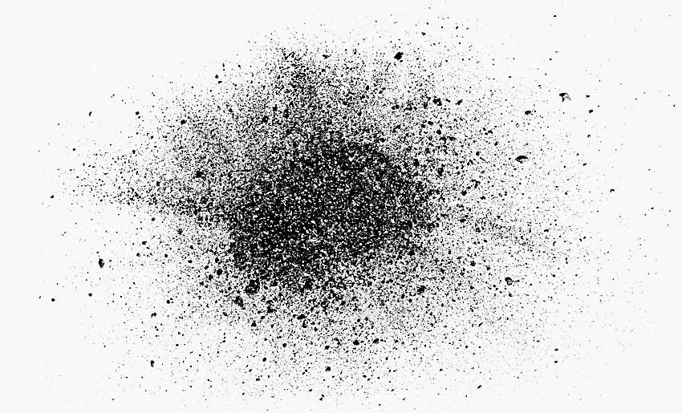
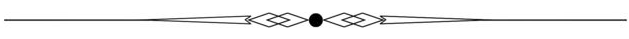

# dust Vignette

### Vincent Runge and Simon Querné

#### LaMME, Evry University

## Introduction

The `dust` package contains methods **for detecting multiple
change-points within time-series** based on the optimal partitioning
algorithm, a dynamic programming (DP) algorithm. We optimize a penalized
likelihood and the DP algorithm is encoded with a pruning rule for
reducing execution time. The novelty of the `dust` package consists in
its pruning step. We use a **new pruning rule**, different from the two
standard ones: [PELT rule
(2012)](https://doi.org/10.1080/01621459.2012.737745) and [FPOP rule
(2017)](https://doi.org/10.1007/s11222-016-9636-3).

We called this method the **DUST** pruning rule, standing for
**Du**ality **S**imple **T**est. It is based on an optimization problem
under inequality constraints and its dual for discarding indices in the
search for the last change-point index. See the [DUST
paper](https://doi.org/10.48550/arXiv.2507.02467).

We propose:

- `dust.1D` for univariate data with 8 models of the **exponential
  family** (Gauss, Poisson, Exponential, Geometric, Bernoulli, Binomial,
  Negative Binomial, Variance)

- `dust.MD` for independent multivariate data (same models)

- `dust.meanVar` for changes in mean and variance (Gaussian model)

Each function has an object version (`dust.object.1D`, `dust.object.MD`,
`dust.object.meanVar`) to add new data step by step. Computations can
use SIMD instructions with the [Google
Highway](https://github.com/google/highway) library.

> [Quick start](#start)

> [Rcpp Object Structure](#rcpp)

> [Models And Data Generators](#Models)

> [dust Algorithms](#dust1D)

> [Pruning Capacity](#pruning)

## Quick start

### Installing the dust Rcpp package

The package can be installed from the github repo with the following
command:

    remotes::install_github("vrunge/dust")

The [Google Highway](https://github.com/google/highway) library (SIMD and threads) is a git submodule in `src/highway`, downloaded by `remotes::install_github`. From a clone: `git clone --recursive https://github.com/vrunge/dust` (or `git submodule update --init` in an existing clone), and `git submodule update --remote` to use the latest Highway.

### A simple example

We generate a 1D time series of length `240` from the Gaussian model
with two changes.

    library(dust)
    set.seed(11)
    y <- dataGenerator_1D(chpts = c(80, 160, 240), parameters = c(0, 2, -1), type = "gauss")
    fit <- dust.1D(y)
    fit$changepoints

    ## [1]  80 160 240

Here the penalty value is by default set to `2 log(n)` for `n` data
points and the model to `gauss`. That is, we did
`dust.1D(y, penalty = 2*log(length(y)), model = "gauss", method = "DUST")`.
For the Gaussian model, the data should first be normalized with
`data_normalization_1D` (noise standard deviation equal to 1).

*The result is a list whose elements are:*

- `changepoints`: the change points (the index ending each of the
  segments)

- `lastIndexSet`: the non-pruned indices at the end of the analysis

- `nb`: the number of indices retained after pruning at each time step (its length
  is equal to data length)

- `costQ`: the minimal penalized cost at each time step, on the -2 log-likelihood scale, with terms independent of the segmentation omitted. For `gauss`, add `sum(y[1:t]^2)` to `costQ[t]` to obtain the residual sum of squares plus the change-point penalties.

Vector `nb` is a kind of complexity control vector, its values are
directly related to the time complexity of the algorithm.

### Multivariate data

With `dust.MD`, each row of the data matrix is a time series. All the
rows have the same model and the same change points.

    set.seed(13)
    multi <- dataGenerator_MD(chpts = c(80, 160), parameters = cbind(c(0, 2), c(0, -1)), type = "gauss")
    dust.MD(multi)$changepoints

    ## [1]  80 160

The default penalty is `2 * nrow(data) * log(ncol(data))`.

### Changes in mean and variance

    set.seed(12)
    z <- c(rnorm(100, sd = 0.6), rnorm(100, sd = 2), rnorm(100, mean = 1, sd = 0.8))
    dust.meanVar(z)$changepoints

    dust.meanVar(z, method = "2D")$changepoints

Here the default penalty is `4 log(n)` and methods `"1D"` and `"2D"` use
one or two constraints in the pruning test.
Segments need at least two different values. Pruning certificates are applied only after the replacement segment also contains two different values; `nb` includes candidates waiting for this condition.

[(Back to Top)](#top)

## Rcpp Object Structure

The objects receive data step by step. We append data with
`append_data`, update the segmentation with `update_partition` and read
the result with `get_partition`. The penalty is fixed at the first call
of `append_data`.

    penalty <- 2 * log(length(y))
    obj <- dust.object.1D(model = "gauss", method = "DUST")
    obj$append_data(y[1:120], penalty)
    obj$update_partition()
    obj$get_partition()$changepoints

    ## [1]  80 120

    obj$append_data(y[121:240], NULL)
    obj$update_partition()
    obj$get_partition()$changepoints

    ## [1]  80 160 240

`dust.object.meanVar` and `dust.object.MD` work the same way (with
matrices for `dust.object.MD`). The `get_info` method gives the
parameters of the object.

[(Back to Top)](#top)

## Models And Data Generators

`dataGenerator_1D` generates univariate data and `dataGenerator_MD`
multivariate data (one time series per row) with the same models.

<table>
<thead>
<tr>
<th style="text-align: left;"><code>model</code></th>
<th style="text-align: left;">parameter</th>
<th style="text-align: left;">data</th>
</tr>
</thead>
<tbody>
<tr>
<td style="text-align: left;"><code>gauss</code></td>
<td style="text-align: left;">mean (variance 1)</td>
<td style="text-align: left;">real values</td>
</tr>
<tr>
<td style="text-align: left;"><code>poisson</code></td>
<td style="text-align: left;">rate</td>
<td style="text-align: left;">counts</td>
</tr>
<tr>
<td style="text-align: left;"><code>exp</code></td>
<td style="text-align: left;">rate</td>
<td style="text-align: left;">positive values</td>
</tr>
<tr>
<td style="text-align: left;"><code>geom</code></td>
<td style="text-align: left;">probability</td>
<td style="text-align: left;">number of trials (&gt;= 1)</td>
</tr>
<tr>
<td style="text-align: left;"><code>bern</code></td>
<td style="text-align: left;">probability</td>
<td style="text-align: left;">0 or 1</td>
</tr>
<tr>
<td style="text-align: left;"><code>binom</code></td>
<td style="text-align: left;">probability</td>
<td style="text-align: left;">counts divided by the number of
trials</td>
</tr>
<tr>
<td style="text-align: left;"><code>negbin</code></td>
<td style="text-align: left;">probability</td>
<td style="text-align: left;">counts divided by the number of
successes</td>
</tr>
<tr>
<td style="text-align: left;"><code>variance</code></td>
<td style="text-align: left;">standard deviation (mean 0)</td>
<td style="text-align: left;">nonzero values</td>
</tr>
</tbody>
</table>

    set.seed(5)
    counts <- dataGenerator_1D(chpts = c(60, 120, 180), parameters = c(2, 8, 3), type = "poisson")
    dust.1D(counts, model = "poisson")$changepoints

For binomial and negative binomial data, use
`data_normalization_1D(y, type, size)` with the number of trials (or
successes) and divide the penalty by the same value.
For Poisson likelihood segmentation, use the original counts. If you divide them by their positive mean `m`, divide the penalty by `m` too; leaving the penalty unchanged changes the optimization problem. Exponential rescaling only adds a constant independent of the segmentation.

[(Back to Top)](#top)

## dust Algorithms

For univariate data (`dust.1D`), the pruning `method` is:

- `"DUST"`: closed-form maximum of the decision function (default)

- `"DUSTib"`: one-constraint test with explicit domain checks

- `"PELT"`: PELT pruning rule

- `"OP"`: no pruning

The constraint is the largest non-pruned index smaller than the tested
index.

For multivariate data (`dust.MD`), the decision function has one
multiplier per constraint (`constraints` = number of indices used in the
test, 1 by default) and we can use:

- `"exact"`: Gaussian dual maximization (closed formulas with one or two constraints, a face solver with more). For other models, one-constraint maxima are found numerically; with two constraints, axis maxima and unbounded directions are evaluated, with an interior critical point also considered in dimension two. In higher dimensions this is a conservative pruning test, not a general exact maximizer. These non-Gaussian tests use at most two constraints, including when `constraints = NULL`; `get_info()` reports this limit.

- `"coordinateDescent"`: coordinate descent, `nbIterations` sweeps

- `"QN"`: quasi-Newton (BFGS) with Armijo condition, `nbIterations`
  steps

- `"randomEval"`: evaluation at `nbIterations` random points

- `"PELT"` and `"OP"`

<!-- -->

    dust.MD(multi, method = "coordinateDescent", constraints = 2, nbIterations = 10)$changepoints

    ## [1]  80 160

    dust.MD(multi, method = "QN", constraints = 2)$changepoints

    ## [1]  80 160

These methods target the same optimal penalized objective; their pruning effort and number of non-pruned indices differ. When several segmentations tie, the returned change points need not be identical.

[(Back to Top)](#top)

## Pruning Capacity

The vector `nb` gives the number of non-pruned indices over time. The following example compares the pruning of DUST and PELT on Gaussian noise without changes. The number retained depends on the data and penalty; DUST typically keeps fewer indices in this setting.

    set.seed(21)
    x <- rnorm(10^4)
    c(DUST = mean(dust.1D(x, method = "DUST")$nb), PELT = mean(dust.1D(x, method = "PELT")$nb))

The simulations of the paper are in the folder `paper_simulations/` (not
in the CRAN package).

[(Back to Top)](#top)
