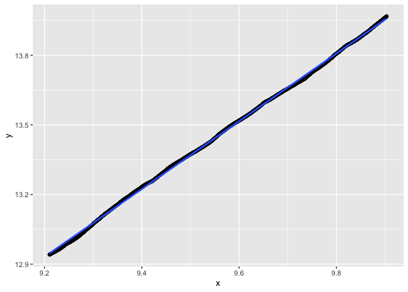
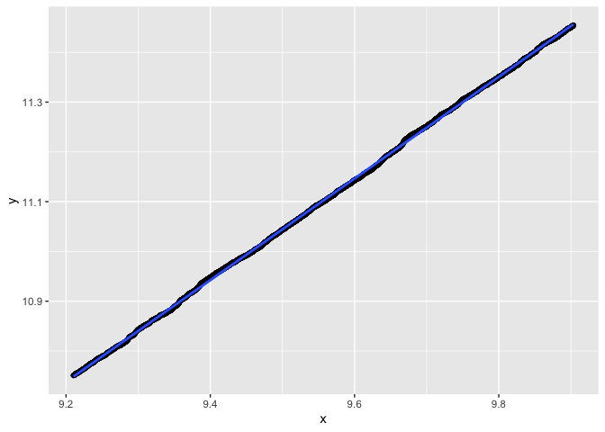
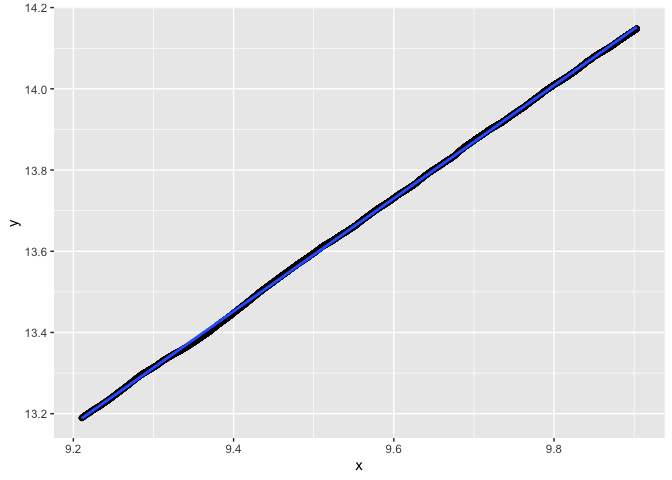
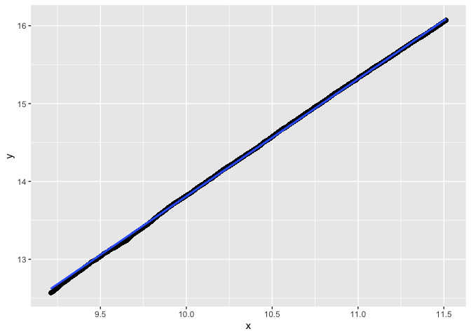

```r
library(dust) #our package
```

**We demonstrate using simulations that the number of non-pruned elements is of order `sqrt(n)` for `n` data points when using the dust method with uniform sampling.**

This result is true for all the model considered and all possible penalty values.

It remains to prove it formally...

# Testing with 100 data points with Gauss model

We test the `dust_R_1D` function with different pruning options and different data models.


```r
data <- dataGenerator_1D(chpts = 100, parameters = 0, sdNoise = 1, type = "gauss")

(res0 <- dust_R_1D(data, type = "gauss", penalty = 2*log(100), pruningOpt = 0)) #no pruning
```

```
## $changepoints
## [1] 100
## 
## $nb
##   [1]   1   2   3   4   5   6   7   8   9  10  11  12  13  14  15  16  17  18
##  [19]  19  20  21  22  23  24  25  26  27  28  29  30  31  32  33  34  35  36
##  [37]  37  38  39  40  41  42  43  44  45  46  47  48  49  50  51  52  53  54
##  [55]  55  56  57  58  59  60  61  62  63  64  65  66  67  68  69  70  71  72
##  [73]  73  74  75  76  77  78  79  80  81  82  83  84  85  86  87  88  89  90
##  [91]  91  92  93  94  95  96  97  98  99 100
## 
## $lastIndexSet
##   [1]   0   1   2   3   4   5   6   7   8   9  10  11  12  13  14  15  16  17
##  [19]  18  19  20  21  22  23  24  25  26  27  28  29  30  31  32  33  34  35
##  [37]  36  37  38  39  40  41  42  43  44  45  46  47  48  49  50  51  52  53
##  [55]  54  55  56  57  58  59  60  61  62  63  64  65  66  67  68  69  70  71
##  [73]  72  73  74  75  76  77  78  79  80  81  82  83  84  85  86  87  88  89
##  [91]  90  91  92  93  94  95  96  97  98  99 100
## 
## $costQ
##   [1] -0.74773538 -0.08276270 -0.51763466 -0.37052839 -0.07489668 -0.01976397
##   [7] -0.01099625 -0.70022484 -0.66782898 -0.57758647 -0.81089219 -0.83377702
##  [13] -1.21048187 -1.21999525 -0.87391693 -0.68252283 -0.38440321 -0.53873394
##  [19] -1.43747304 -1.48694514 -1.11020247 -0.83959837 -0.76892005 -0.49807093
##  [25] -0.61711295 -0.78482408 -0.44822380 -0.19646904 -0.35541476 -0.47105267
##  [31] -0.30358941 -0.22537414 -0.32193114 -0.18853497 -0.07791789 -0.19120772
##  [37] -0.12330985 -0.06160917 -0.05998698 -0.08498652 -0.05119741 -0.01615676
##  [43] -0.09762939 -0.22103124 -0.13967656 -0.28196234 -0.23193886 -0.23114611
##  [49] -0.28689052 -0.36162039 -0.34121467 -0.21828055 -0.34344813 -0.31960076
##  [55] -0.36199763 -0.35753229 -0.30435132 -0.17556830 -0.23974953 -0.27270565
##  [61] -0.44477201 -0.44371735 -0.49746133 -0.62608402 -0.64279870 -0.62384864
##  [67] -0.45764204 -0.21070554 -0.34430411 -0.42298394 -0.49803385 -0.31670592
##  [73] -0.41925162 -0.16580000 -0.25404156 -0.31224443 -0.40167487 -0.54455108
##  [79] -0.52191972 -0.58141202 -0.47709637 -0.35260106 -0.41783240 -0.36754027
##  [85] -0.35217534 -0.36866759 -0.29482758 -0.33589955 -0.58459204 -0.57976222
##  [91] -0.54148685 -0.57244172 -0.50611803 -0.41539393 -0.52520533 -0.41133632
##  [97] -0.61599305 -0.46574536 -0.38548566 -0.37143337
```

```r
(res1 <- dust_R_1D(data, type = "gauss", penalty = 2*log(100), pruningOpt = 1)) #PELT
```

```
## $changepoints
## [1] 100
## 
## $nb
##   [1]   1   2   3   4   5   6   7   8   9  10  11  12  13  14  15  16  17  18
##  [19]  19  20  21  22  23  24  25  26  27  28  29  30  31  32  33  34  35  36
##  [37]  37  38  39  40  41  42  43  44  45  46  47  48  49  50  51  52  53  54
##  [55]  55  56  57  58  59  60  61  62  63  64  65  66  67  68  69  70  71  72
##  [73]  73  74  75  76  77  78  79  80  81  82  83  84  85  86  87  88  89  90
##  [91]  91  92  93  94  95  96  97  98  99 100
## 
## $lastIndexSet
##   [1]   0   1   2   3   4   5   6   7   8   9  10  11  12  13  14  15  16  17
##  [19]  18  19  20  21  22  23  24  25  26  27  28  29  30  31  32  33  34  35
##  [37]  36  37  38  39  40  41  42  43  44  45  46  47  48  49  50  51  52  53
##  [55]  54  55  56  57  58  59  60  61  62  63  64  65  66  67  68  69  70  71
##  [73]  72  73  74  75  76  77  78  79  80  81  82  83  84  85  86  87  88  89
##  [91]  90  91  92  93  94  95  96  97  98  99 100
## 
## $costQ
##   [1] -0.74773538 -0.08276270 -0.51763466 -0.37052839 -0.07489668 -0.01976397
##   [7] -0.01099625 -0.70022484 -0.66782898 -0.57758647 -0.81089219 -0.83377702
##  [13] -1.21048187 -1.21999525 -0.87391693 -0.68252283 -0.38440321 -0.53873394
##  [19] -1.43747304 -1.48694514 -1.11020247 -0.83959837 -0.76892005 -0.49807093
##  [25] -0.61711295 -0.78482408 -0.44822380 -0.19646904 -0.35541476 -0.47105267
##  [31] -0.30358941 -0.22537414 -0.32193114 -0.18853497 -0.07791789 -0.19120772
##  [37] -0.12330985 -0.06160917 -0.05998698 -0.08498652 -0.05119741 -0.01615676
##  [43] -0.09762939 -0.22103124 -0.13967656 -0.28196234 -0.23193886 -0.23114611
##  [49] -0.28689052 -0.36162039 -0.34121467 -0.21828055 -0.34344813 -0.31960076
##  [55] -0.36199763 -0.35753229 -0.30435132 -0.17556830 -0.23974953 -0.27270565
##  [61] -0.44477201 -0.44371735 -0.49746133 -0.62608402 -0.64279870 -0.62384864
##  [67] -0.45764204 -0.21070554 -0.34430411 -0.42298394 -0.49803385 -0.31670592
##  [73] -0.41925162 -0.16580000 -0.25404156 -0.31224443 -0.40167487 -0.54455108
##  [79] -0.52191972 -0.58141202 -0.47709637 -0.35260106 -0.41783240 -0.36754027
##  [85] -0.35217534 -0.36866759 -0.29482758 -0.33589955 -0.58459204 -0.57976222
##  [91] -0.54148685 -0.57244172 -0.50611803 -0.41539393 -0.52520533 -0.41133632
##  [97] -0.61599305 -0.46574536 -0.38548566 -0.37143337
```

```r
(res2 <- dust_R_1D(data, type = "gauss", penalty = 2*log(100), pruningOpt = 2)) #dust
```

```
## $changepoints
## [1] 100
## 
## $nb
##   [1]  1  1  1  2  3  2  2  3  3  3  3  2  2  1  2  3  4  3  3  4  5  4  4  5  6
##  [26]  6  7  7  8  8  9  9  9  7  8  8  8  8  9  8  8  9  8  7  7  8  8  9  8  7
##  [51]  7  7  6  5  6  5  5  5  5  4  4  5  5  6  6  7  7  7  7  8  7  7  8  9 10
##  [76] 11  9  8  8  7  7  8  9  8  8  9 10  9  9  7  7  6  7  7  7  6  7  6  7  7
## 
## $lastIndexSet
## [1]   0  90  92  95  96  97  98 100
## 
## $costQ
##   [1] -0.74773538 -0.08276270 -0.51763466 -0.37052839 -0.07489668 -0.01976397
##   [7] -0.01099625 -0.70022484 -0.66782898 -0.57758647 -0.81089219 -0.83377702
##  [13] -1.21048187 -1.21999525 -0.87391693 -0.68252283 -0.38440321 -0.53873394
##  [19] -1.43747304 -1.48694514 -1.11020247 -0.83959837 -0.76892005 -0.49807093
##  [25] -0.61711295 -0.78482408 -0.44822380 -0.19646904 -0.35541476 -0.47105267
##  [31] -0.30358941 -0.22537414 -0.32193114 -0.18853497 -0.07791789 -0.19120772
##  [37] -0.12330985 -0.06160917 -0.05998698 -0.08498652 -0.05119741 -0.01615676
##  [43] -0.09762939 -0.22103124 -0.13967656 -0.28196234 -0.23193886 -0.23114611
##  [49] -0.28689052 -0.36162039 -0.34121467 -0.21828055 -0.34344813 -0.31960076
##  [55] -0.36199763 -0.35753229 -0.30435132 -0.17556830 -0.23974953 -0.27270565
##  [61] -0.44477201 -0.44371735 -0.49746133 -0.62608402 -0.64279870 -0.62384864
##  [67] -0.45764204 -0.21070554 -0.34430411 -0.42298394 -0.49803385 -0.31670592
##  [73] -0.41925162 -0.16580000 -0.25404156 -0.31224443 -0.40167487 -0.54455108
##  [79] -0.52191972 -0.58141202 -0.47709637 -0.35260106 -0.41783240 -0.36754027
##  [85] -0.35217534 -0.36866759 -0.29482758 -0.33589955 -0.58459204 -0.57976222
##  [91] -0.54148685 -0.57244172 -0.50611803 -0.41539393 -0.52520533 -0.41133632
##  [97] -0.61599305 -0.46574536 -0.38548566 -0.37143337
```

```r
(res3 <- dust_R_1D(data, type = "gauss", penalty = 2*log(100), pruningOpt = 3)) #dust + PELT
```

```
## $changepoints
## [1] 100
## 
## $nb
##   [1] 1 2 2 2 3 3 1 2 2 3 2 1 2 3 3 4 5 5 4 4 5 4 4 5 5 6 6 6 6 7 6 7 7 7 8 8 7
##  [38] 7 8 5 6 7 6 7 8 9 9 8 7 8 8 6 6 5 4 2 3 4 5 5 5 6 6 7 7 8 8 8 8 7 7 7 7 8
##  [75] 9 9 7 6 5 5 5 6 7 7 6 6 7 7 6 6 7 7 7 6 7 7 7 7 8 7
## 
## $lastIndexSet
## [1]   0  90  92  95  97  98  99 100
## 
## $costQ
##   [1] -0.74773538 -0.08276270 -0.51763466 -0.37052839 -0.07489668 -0.01976397
##   [7] -0.01099625 -0.70022484 -0.66782898 -0.57758647 -0.81089219 -0.83377702
##  [13] -1.21048187 -1.21999525 -0.87391693 -0.68252283 -0.38440321 -0.53873394
##  [19] -1.43747304 -1.48694514 -1.11020247 -0.83959837 -0.76892005 -0.49807093
##  [25] -0.61711295 -0.78482408 -0.44822380 -0.19646904 -0.35541476 -0.47105267
##  [31] -0.30358941 -0.22537414 -0.32193114 -0.18853497 -0.07791789 -0.19120772
##  [37] -0.12330985 -0.06160917 -0.05998698 -0.08498652 -0.05119741 -0.01615676
##  [43] -0.09762939 -0.22103124 -0.13967656 -0.28196234 -0.23193886 -0.23114611
##  [49] -0.28689052 -0.36162039 -0.34121467 -0.21828055 -0.34344813 -0.31960076
##  [55] -0.36199763 -0.35753229 -0.30435132 -0.17556830 -0.23974953 -0.27270565
##  [61] -0.44477201 -0.44371735 -0.49746133 -0.62608402 -0.64279870 -0.62384864
##  [67] -0.45764204 -0.21070554 -0.34430411 -0.42298394 -0.49803385 -0.31670592
##  [73] -0.41925162 -0.16580000 -0.25404156 -0.31224443 -0.40167487 -0.54455108
##  [79] -0.52191972 -0.58141202 -0.47709637 -0.35260106 -0.41783240 -0.36754027
##  [85] -0.35217534 -0.36866759 -0.29482758 -0.33589955 -0.58459204 -0.57976222
##  [91] -0.54148685 -0.57244172 -0.50611803 -0.41539393 -0.52520533 -0.41133632
##  [97] -0.61599305 -0.46574536 -0.38548566 -0.37143337
```


```r
all(res0$costQ == res1$costQ)
```

```
## [1] TRUE
```

```r
all(res0$costQ == res2$costQ)
```

```
## [1] TRUE
```

```r
all(res0$costQ == res3$costQ)
```

```
## [1] TRUE
```

```r
sum(res0$nb)
```

```
## [1] 5050
```

```r
sum(res1$nb)
```

```
## [1] 5050
```

```r
sum(res2$nb)
```

```
## [1] 622
```

```r
sum(res3$nb)
```

```
## [1] 574
```


Percent of indices left with PELT in comparison with no pruning


```r
cat(sum(res1$nb)/sum(res0$nb)*100, "%")
```

```
## 100 %
```


Percent of indices left with DUST and DUST+PELT in comparison with PELT 


```r
cat(sum(res2$nb)/sum(res1$nb)*100, "%")
```

```
## 12.31683 %
```

```r
cat(sum(res3$nb)/sum(res1$nb)*100, "%")
```

```
## 11.36634 %
```


# Pruning capacity


## Gauss


```r
n <- 2*10^4
data <- dataGenerator_1D(chpts = n, parameters = 0, sdNoise = 1, type = "gauss")
res3 <- dust_R_1D(data, type = "gauss", penalty = 2*log(n), pruningOpt = 3) #dust + PELT
cat(sum(res3$nb)/sum(1:n)*100, "%. Nb indices left at n: ", length(res3$lastIndexSet))
```

```
## 0.6838558 %. Nb indices left at n:  85
```


Regression analysis


```r
regIndices(res3$nb)
```

```
##              Estimate   Std. Error   t value Pr(>|t|)
## (Intercept) 0.6197731 0.0029402244  210.7911        0
## x           1.3638846 0.0003063147 4452.5605        0
```

```
## `geom_smooth()` using formula = 'y ~ x'
```

<!-- -->


```r
n <- 2*10^4
data <- dataGenerator_1D(chpts = n, parameters = 0, sdNoise = 1, type = "gauss")
res3 <- dust_R_1D(data, type = "gauss", penalty = 2*log(n), pruningOpt = 2) #dust
cat(sum(res3$nb)/sum(1:n)*100, "%. Nb indices left at n: ", length(res3$lastIndexSet))
```

```
## 0.6668277 %. Nb indices left at n:  77
```

```r
regIndices(res3$nb)
```

```
##               Estimate   Std. Error    t value Pr(>|t|)
## (Intercept) -0.1903161 0.0032678517  -58.23889        0
## x            1.4434515 0.0003404471 4239.86991        0
```

```
## `geom_smooth()` using formula = 'y ~ x'
```

<!-- -->


```r
n <- 2*10^4
data <- dataGenerator_1D(chpts = n, parameters = 0, sdNoise = 1, type = "gauss")
res3 <- dust_R_1D(data, type = "gauss", penalty = 4*log(n), pruningOpt = 3) #dust + PELT
cat(sum(res3$nb)/sum(1:n)*100, "%. Nb indices left at n: ", length(res3$lastIndexSet))
```

```
## 0.5820644 %. Nb indices left at n:  83
```

```r
regIndices(res3$nb)
```

```
##               Estimate   Std. Error  t value Pr(>|t|)
## (Intercept) -0.4944258 0.0030713309 -160.981        0
## x            1.4593596 0.0003199734 4560.877        0
```

```
## `geom_smooth()` using formula = 'y ~ x'
```

<!-- -->


```r
n <- 2*10^4
data <- dataGenerator_1D(chpts = n, parameters = 0, sdNoise = 1, type = "gauss")
res3 <- dust_R_1D(data, type = "gauss", penalty = 10*log(n), pruningOpt = 3) #dust + PELT
cat(sum(res3$nb)/sum(1:n)*100, "%. Nb indices left at n: ", length(res3$lastIndexSet))
```

```
## 0.46008 %. Nb indices left at n:  85
```

```r
regIndices(res3$nb)
```

```
##              Estimate   Std. Error  t value Pr(>|t|)
## (Intercept) -1.070120 0.0034911330 -306.525        0
## x            1.493917 0.0003637087 4107.453        0
```

```
## `geom_smooth()` using formula = 'y ~ x'
```

<!-- -->


```r
n <- 2*10^4
data <- dataGenerator_1D(chpts = n, parameters = 0, sdNoise = 1, type = "gauss")
res3 <- dust_R_1D(data, type = "gauss", penalty = 0.1*log(n), pruningOpt = 3) #dust + PELT
cat(sum(res3$nb)/sum(1:n)*100, "%. Nb indices left at n: ", length(res3$lastIndexSet))
```

```
## 0.04714114 %. Nb indices left at n:  8
```

```r
regIndices(res3$nb)
```

```
##             Estimate   Std. Error   t value Pr(>|t|)
## (Intercept) 1.341045 0.0013795952  972.0567        0
## x           1.021404 0.0001437272 7106.5492        0
```

```
## `geom_smooth()` using formula = 'y ~ x'
```

<!-- -->


## Binomial


```r
n <- 2*10^4
data <- dataGenerator_1D(chpts = n, parameters = 0.5, type = "binom")
data <- data/10
res3 <- dust_R_1D(data, type = "binom", penalty = 5*log(n), pruningOpt = 2) #dust
cat(sum(res3$nb)/sum(1:n)*100, "%. Nb indices left at n: ", length(res3$lastIndexSet))
```

```
## 0.2140943 %. Nb indices left at n:  37
```

```r
regIndices(res3$nb)
```

```
##              Estimate   Std. Error  t value Pr(>|t|)
## (Intercept) -3.424862 0.0044697803 -766.226        0
## x            1.654475 0.0004656649 3552.930        0
```

```
## `geom_smooth()` using formula = 'y ~ x'
```

<!-- -->


```r
n <- 2*10^4
data <- dataGenerator_1D(chpts = n, parameters = 0.5, type = "binom")
data <- data/10
res3 <- dust_R_1D(data, type = "binom", penalty = 20*log(n), pruningOpt = 2) #dust
cat(sum(res3$nb)/sum(1:n)*100, "%. Nb indices left at n: ", length(res3$lastIndexSet))
```

```
## 0.1043573 %. Nb indices left at n:  23
```

```r
regIndices(res3$nb)
```

```
##              Estimate   Std. Error   t value Pr(>|t|)
## (Intercept) -3.910700 0.0039626403 -986.8925        0
## x            1.633267 0.0004128307 3956.2648        0
```

```
## `geom_smooth()` using formula = 'y ~ x'
```

<!-- -->


```r
n <- 2*10^4
data <- dataGenerator_1D(chpts = n, parameters = 0.5, type = "binom")
data <- data/10
res3 <- dust_R_1D(data, type = "binom", penalty = 0.1*log(n), pruningOpt = 2) #dust
cat(sum(res3$nb)/sum(1:n)*100, "%. Nb indices left at n: ", length(res3$lastIndexSet))
```

```
## 0.739587 %. Nb indices left at n:  97
```

```r
regIndices(res3$nb)
```

```
##               Estimate   Std. Error   t value Pr(>|t|)
## (Intercept) -0.4784154 0.0047382077 -100.9697        0
## x            1.4849619 0.0004936298 3008.2498        0
```

```
## `geom_smooth()` using formula = 'y ~ x'
```

<!-- -->


## Poisson


```r
n <- 2*10^4
data <- dataGenerator_1D(chpts = n, parameters = 10, type = "poisson")
res3 <- dust_R_1D(data, type = "poisson", penalty = 10*log(n), pruningOpt = 2) #dust
cat(sum(res3$nb)/sum(1:n)*100, "%. Nb indices left at n: ", length(res3$lastIndexSet))
```

```
## 0.4646898 %. Nb indices left at n:  71
```

```r
regIndices(res3$nb)
```

```
##              Estimate   Std. Error  t value Pr(>|t|)
## (Intercept) -1.652722 0.0026173979 -631.437        0
## x            1.555382 0.0002726824 5704.007        0
```

```
## `geom_smooth()` using formula = 'y ~ x'
```

<!-- -->


```r
n <- 2*10^4
data <- dataGenerator_1D(chpts = n, parameters = 10, type = "poisson")
res3 <- dust_R_1D(data, type = "poisson", penalty = 30*log(n), pruningOpt = 2) #dust
cat(sum(res3$nb)/sum(1:n)*100, "%. Nb indices left at n: ", length(res3$lastIndexSet))
```

```
## 0.310211 %. Nb indices left at n:  67
```

```r
regIndices(res3$nb)
```

```
##              Estimate   Std. Error   t value Pr(>|t|)
## (Intercept) -2.936779 0.0040805721 -719.6977        0
## x            1.644310 0.0004251169 3867.9001        0
```

```
## `geom_smooth()` using formula = 'y ~ x'
```

<!-- -->


```r
n <- 2*10^4
data <- dataGenerator_1D(chpts = n, parameters = 10, type = "poisson")
res3 <- dust_R_1D(data, type = "poisson", penalty = 1*log(n), pruningOpt = 2) #dust
cat(sum(res3$nb)/sum(1:n)*100, "%. Nb indices left at n: ", length(res3$lastIndexSet))
```

```
## 0.6973491 %. Nb indices left at n:  93
```

```r
regIndices(res3$nb)
```

```
##              Estimate   Std. Error   t value Pr(>|t|)
## (Intercept) 0.3773185 0.0013882950  271.7856        0
## x           1.3909337 0.0001446336 9616.9497        0
```

```
## `geom_smooth()` using formula = 'y ~ x'
```

<!-- -->


# Conclusions

The smaller the penalty, the more we prune. The slope is often around 1.5. Sometimes more?


Last test with `10^5` data points.


```r
n <- 10^5
data <- dataGenerator_1D(chpts = n, parameters = 0.5, type = "binom")
data <- data/10
res3 <- dust_R_1D(data, type = "binom", penalty = 1*log(n), pruningOpt = 2) #dust
cat(sum(res3$nb)/sum(1:n)*100, "%. Nb indices left at n: ", length(res3$lastIndexSet))
```

```
## 0.1904815 %. Nb indices left at n:  107
```

```r
regIndices(res3$nb)
```

```
##              Estimate   Std. Error   t value Pr(>|t|)
## (Intercept) -1.247865 8.863733e-04 -1407.832        0
## x            1.505804 8.218721e-05 18321.632        0
```

```
## `geom_smooth()` using formula = 'y ~ x'
```

<!-- -->


